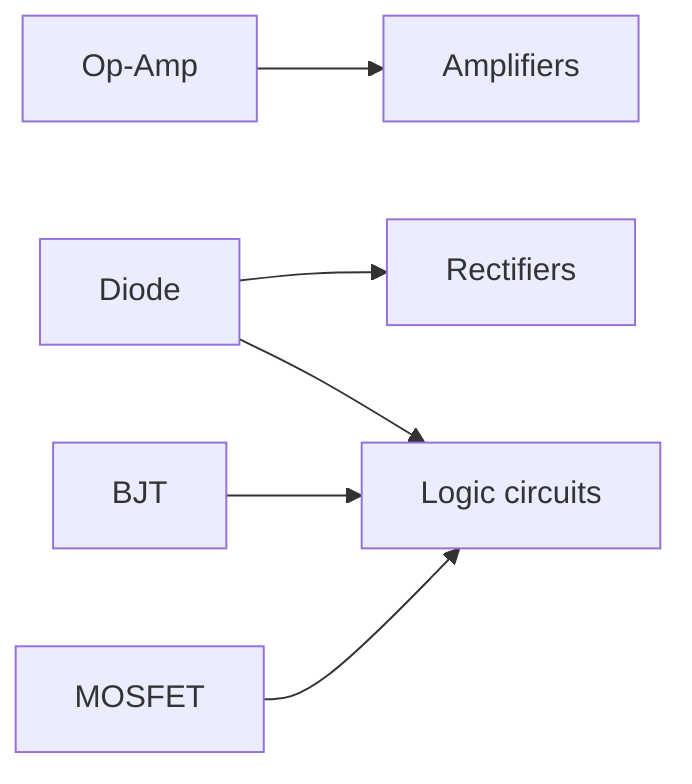

# Course Overview: CSE 251, Electronics and Circuits

> [!abstract] In one line
> Learn four new components (**Op-Amp, diode, BJT, MOSFET**) and use them to build **amplifiers, rectifiers and logic circuits**. It is the basics of signal processing, not a deep dive. Everything also appears in the lab.

## How the pieces connect

| New component | Used to build | Notes from Lecture 1 |
|---|---|---|
| Op-Amp | Amplifiers | Does mathematical operations: $x + y$, $x - y$, $x \times y$ |
| Diode | Rectifiers; can also switch | Maybe seen at intermediate (HSC) level |
| BJT | Logic circuits (as a switch) | |
| MOSFET | Logic circuits (as a switch) | |

- **Logic operations** ($A \text{ OR } B$, $A \text{ AND } B$) are done by logic circuits, and logic circuits need **switches**.
- **Signal processing** here means conditioning and processing signals and doing logic operations. The teacher said the course does not go into full signal processing, only the basics.

## Prerequisites the teacher assumed

- Nodes and potential difference (from last semester)
- Logic circuits (from CSE 260)
- Diodes (possibly from intermediate level)

## Starting point: line circuits

Before any new component, the course first teaches a simpler way to draw and analyse circuits. See [Lecture 01](Lectures/2026-10-04%20Lecture%2001%20-%20Line%20Circuit%20Representation.md).

Related: [Course Index](INDEX.md), [Formula Sheet](Formula%20Sheet.md)
