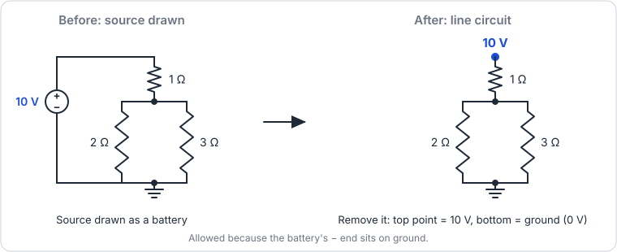
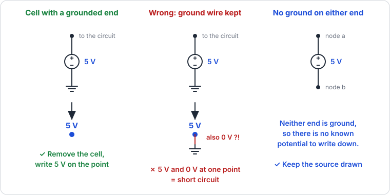
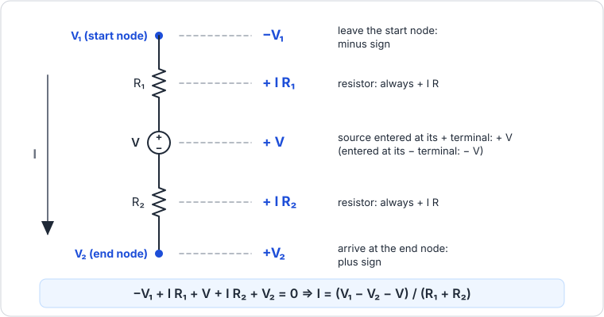
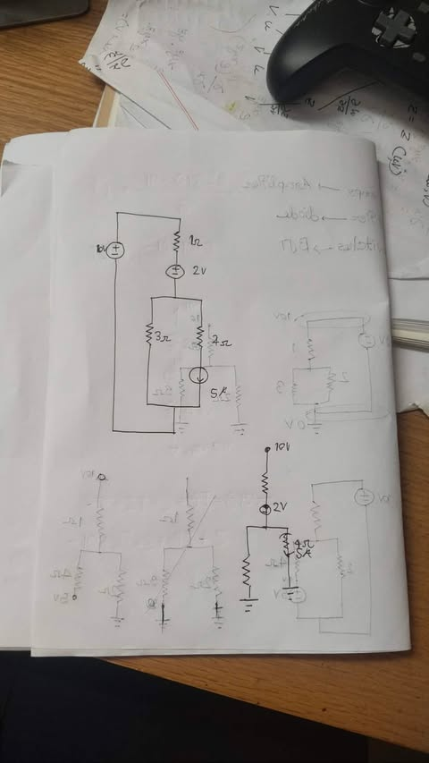
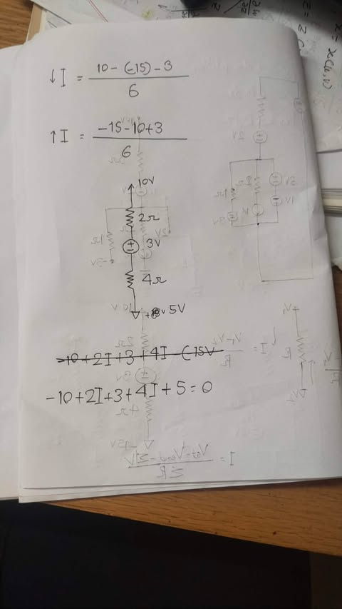
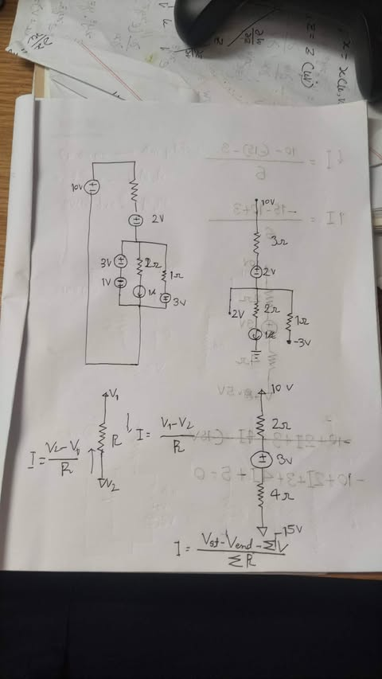

# Lecture 01 - Line Circuit Representation

> [!abstract] Summary
> - A **line circuit** is a simplified drawing where voltage sources are deleted and replaced by a **potential written on a point** (e.g. "10 V").
> - You may delete a source **only if one of its ends is ground**. The other end's potential then follows from $V = V_{(+)} - V_{(-)}$.
> - On a line circuit, the current through a path is $I = \dfrac{V_{start} - V_{end} - \sum V}{\sum R}$.
> - KVL on a line circuit has a fixed sign convention: **minus** the node you leave, **plus** the node you enter.
> - Next class: KVL, CDR, VDR and nodal analysis, all practised on line diagrams.

## 1. Where the course is heading

The teacher opened with the syllabus. In short: three new devices to build (amplifiers, rectifiers, logic circuits) from four new components (Op-Amp, diode, BJT, MOSFET). The full picture is in [Course Overview](../Course%20Overview.md).

## 2. Why line circuit representation?

- Real circuits (amplifiers, rectifiers) are almost never drawn as closed loops "box after box". That style is clumsy and takes too much space.
- Matching your diagram to an IC databook becomes confusing if everything is drawn as boxes.
- The maths gets ugly: a rectifier-like circuit can have **7-8 meshes**. (Mesh analysis is *not* what we use in this course.)
- Fix: draw the circuit more simply. The syllabus calls this **Alternative Circuit Representation** (also called **Line Circuit Representation**).

## 3. Ground and potential points

- Every point in a circuit can be assigned a potential. When we choose **ground**, we call it $0\ \text{V}$.
- Ground can be *any* point. If you chose a different point as $0\ \text{V}$ (say one that was at $2\ \text{V}$), the node voltages would all shift, but **voltage differences, currents and power stay the same**. The choice of ground does not change the maths.
- By convention we take the last point of the circuit (or the one the question names) as $0\ \text{V}$.
- Example: across a $10\ \text{V}$ source, $x - y = 10\ \text{V}$. With $y = 0\ \text{V}$, we get $x = 10\ \text{V}$.

The idea: instead of drawing the source, **reduce it to a potential on a point**. The circuit gets smaller and neater, mesh analysis is out of the picture, and KVL still works cleanly.

## 4. Removing sources

### 4.1 What counts as a node

A **node** is a point where current **branches out**. A point where current just passes straight through is **not** a node.

> [!warning] Don't over-count nodes
> You *can* write an equation at a pass-through point, but it is meaningless: whatever current enters leaves. It only adds extra equations. In the board circuit (photo 1), the only real node is the point where the current splits into the $3\ \Omega$ branch and the $4\ \Omega$ + $5\ \text{A}$ branch.

### 4.2 Step by step

1. Pick the ground point. Draw the ground symbol there.
2. A source whose **− end is ground**: its + end is at $+V$. Delete the source and write that potential on the point.
3. A source whose **+ end is ground**: its − end is at $-V$. Delete it and write $-V$ on the point.
4. Repeat. Each deleted source gives you a known potential that lets you delete the next one.

> [!info] Arrows
> Some people draw an **arrow** instead of writing "10 V". It is just a symbol meaning "this point is at 10 V". It has **nothing to do with current direction**.

### 4.3 When you can and cannot remove a source

> [!warning] A classic quiz mistake
> Replacing a cell with a "5 V" label **and** leaving the ground wire connected. Now the same point is $5\ \text{V}$ and $0\ \text{V}$ at once. They contradict each other, so it is a **short circuit**.
>
> If neither end of a cell touches ground, you **cannot** remove it.

## 5. Worked example: simplifying a circuit

Practice circuit from the board (photo 3 in section 10): a $10\ \text{V}$ source on the left, a resistor and a $2\ \text{V}$ source in series along the top, then three branches down to ground:

- (a) a $3\ \text{V}$ cell stacked on a $1\ \text{V}$ cell
- (b) a $2\ \Omega$ resistor with a $1\ \text{A}$ current source
- (c) a $1\ \Omega$ resistor with a $3\ \text{V}$ cell

Take the bottom rail as ground ($0\ \text{V}$).

| Step | Look at | Reasoning | Result |
|---|---|---|---|
| 1 | $10\ \text{V}$ source | its − end is ground, so its + end is $10\ \text{V}$ | delete it, label the top point **10 V** |
| 2 | $3\ \text{V}$ cell in branch (c) | its + end is ground: $0 - x = 3$ | the point below the $1\ \Omega$ is **−3 V** |
| 3 | $1\ \text{V}$ cell in branch (a) | its + end is ground: $0 - x = 1$ | the point above it is **−1 V** |
| 4 | $3\ \text{V}$ cell above that | $x - (-1) = 3$ | $x = 2\ \text{V}$, so branch (a) collapses to a **2 V** point |

The $2\ \text{V}$ source in the top path stays drawn: neither of its ends touches ground, so the rule does not let us delete it.

**Question: power in the $1\ \Omega$ resistor?** One side is at $2\ \text{V}$, the other at $-3\ \text{V}$:

$$V = 2 - (-3) = 5\ \text{V}, \qquad P = \frac{V^2}{R} = \frac{5^2}{1} = 25\ \text{W}$$

> [!tip] The rule to remember
> Potential difference = potential of the plus side minus potential of the minus side:
> $$V = V_{(+)} - V_{(-)}$$
> If one end of a source is known (especially ground), you can always get the other end from this.

## 6. Ohm's law on a line circuit

For a single resistor between two nodes $V_1$ (top) and $V_2$ (bottom):

$$I_{1 \to 2} = \frac{V_1 - V_2}{R}, \qquad I_{2 \to 1} = \frac{V_2 - V_1}{R}$$

**Direction doesn't matter in the algebra.** If you assume the opposite direction you simply get the negative answer. Neither is wrong, like two people who got $+3$ and $-3$ for the same current counted from opposite ends.

With sources in the path:

$$I = \frac{V_{start} - V_{end} - \sum V}{\sum R}$$

where $\sum V$ counts each source as $+V$ if you enter it at its **+** terminal and $-V$ if you enter it at its **−** terminal.

> [!warning] Why you subtract the sources
> Ohm's law ($V = IR$) holds **only for resistors**.
> - An ideal battery has $R = 0$ and dissipates no power, so $V = IR$ and $P = I^2 R$ are **not valid** for it.
> - An ideal current source has $R = \infty$.
>
> So the total potential difference across the path is *not* all seen by the resistors. Remove the battery's contribution first, then apply Ohm's law to the resistors.

**Example.** Path: $10\ \text{V} \to 2\ \Omega \to 3\ \text{V cell} \to 4\ \Omega \to -15\ \text{V}$, with the cell's + terminal on top.

Total potential difference: $10 - (-15) = 25\ \text{V}$. The resistors do not get all of it; the $3\ \text{V}$ cell takes its share.

Going **down** (enter the cell at +):

$$I = \frac{10 - (-15) - 3}{2 + 4} = \frac{22}{6} = \frac{11}{3}\ \text{A} \approx 3.67\ \text{A}$$

Going **up** (start at $-15\ \text{V}$, enter the cell at −):

$$I = \frac{-15 - 10 - (-3)}{4 + 2} = -\frac{22}{6}\ \text{A}$$

Same magnitude, opposite sign: it is the same current described from the other end.

## 7. KVL on a line circuit

The Ohm's law formula above comes straight from KVL. The convention for writing KVL on a line diagram is **mandatory, not optional**: you need it for every analysis technique in the course.

1. Node you **emerge from** (start): put a **minus** before its voltage, $-V_1$.
2. Node you **enter** (end): put a **plus** before its voltage, $+V_2$.
3. Resistor: $+IR$.
4. Source in the path: $+V$ if you enter at its +, $-V$ if you enter at its −.

$$-V_1 + IR_1 + V_{battery} + IR_2 + V_2 = 0$$

Solving for $I$ gives exactly the Ohm's law formula in section 6.

For the example above ($V_1 = 10$, $V_2 = -15$, cell entered at +):

$$-10 + 2I + 3 + 4I + (-15) = 0 \implies 6I = 22 \implies I = \frac{22}{6}\ \text{A}$$

> [!note] Why "minus the start node"?
> Before the battery was deleted, starting KVL at ground and leaving the battery's − terminal for its + terminal gave $-10\ \text{V}$. Writing $-V_{start}$ at the start node reproduces exactly that.

## 8. Common mistakes

- Keeping the ground wire after replacing a cell with a potential label (short circuit).
- Removing a source that has no grounded end.
- Writing equations at points that are not nodes.
- Using $V = IR$ or $P = I^2R$ on a battery.
- Getting the sign of the unknown end wrong: always use $V_{(+)} - V_{(-)}$ and solve for $x$.
- Entering a source at its − terminal but still writing $+V$.

## 9. Self-check

> [!question]- Q1. A $3\ \text{V}$ cell has its + terminal on ground. What is the potential of its other end?
> $0 - x = 3 \implies x = -3\ \text{V}$.

> [!question]- Q2. A $1\ \Omega$ resistor sits between $2\ \text{V}$ and $-3\ \text{V}$. What power does it dissipate?
> $V = 5\ \text{V}$, so $P = \frac{5^2}{1} = 25\ \text{W}$.

> [!question]- Q3. Can you remove a source if neither end is grounded?
> No. There is no known potential to write on either end, so the source stays drawn.

> [!question]- Q4. Does choosing a different point as ground change the power in a resistor?
> No. Node voltages shift, but voltage differences (and therefore currents and power) stay the same.

> [!question]- Q5. Path $10\ \text{V} \to 2\ \Omega \to 3\ \text{V cell (+ on top)} \to 4\ \Omega \to 5\ \text{V}$. Find $I$ going down.
> $I = \frac{10 - 5 - 3}{2 + 4} = \frac{2}{6} = \frac{1}{3}\ \text{A}$.

## 10. My handwritten notes

**Photo 1: board circuit and its line version.** A $10\ \text{V}$ source (− on ground), $1\ \Omega$, a $2\ \text{V}$ source, then $3\ \Omega$ in parallel with a $4\ \Omega$ resistor in series with a $5\ \text{A}$ current source, back to ground. The bottom right sketch is the simplified version with a "10 V" point on top.

**Photo 2: current in both directions, and the KVL equation.**

**Photo 3: the practice circuit with its line version, and the Ohm's law formulas.**

## 11. Things to double-check

> [!todo] Mismatches and unclear spots
> - **End-node voltage in photo 2.** The handwritten KVL line is $-10 + 2I + 3 + 4I + 5 = 0$ (end node $5\ \text{V}$, giving $I = \frac{1}{3}\ \text{A}$), while the transcript example and the lines above it use $-15\ \text{V}$ ($I = \frac{11}{3}\ \text{A}$). Treated the $5\ \text{V}$ version as a variation; confirm which one the teacher meant.
> - **Practice circuit values (photo 3).** The top resistor reads as $3\ \Omega$ and the top $2\ \text{V}$ source's polarity is unclear in the photo. The transcript mentions neither. The $25\ \text{W}$ answer does not depend on them.
> - **Photo 1, lower-left sketches.** They look like crossed-out attempts (probably the $5\ \text{V}$ / $0\ \text{V}$ mistake from section 4.3), but the handwriting is too small to be sure.
> - **Advising.** The teacher mentioned that advising must be confirmed for a name to appear on the roll; students said everyone confirms by the 8th.

## 12. Next class

- [ ] Revise KVL, CDR (current divider), VDR (voltage divider), nodal analysis. Next class applies all four to line diagrams.
- [ ] Practise deleting sources on a few circuits until the ground rule is automatic.

Related: [Course Overview](../Course%20Overview.md), [Formula Sheet](../Formula%20Sheet.md), [Course Index](../INDEX.md)
