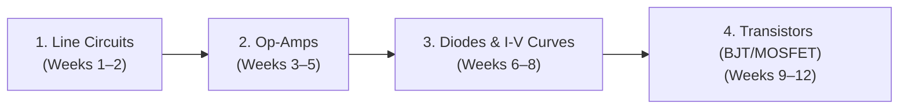

# CSE 251: Course Resources & Study Materials

> [!abstract] Essential Learning Materials
> Curated study materials for **CSE 251 (Electronics and Circuits)** at BRAC University. Includes official BuX topic-wise video lectures by **Mohammed Abid Abrar Sir**, reference textbooks, simulation tools, and problem sets aligned with in-person lectures.

> [!tip] How to use these videos
> These video lectures (primarily recorded for BRACU BuX) cover the entire breadth of the course. Not every single niche topic in the recordings will be tested in class; always cross-reference with your active lecture notes (e.g. [[2026-10-04 Lecture 01 - Line Circuit Representation|Lecture 01]]) and your instructor's slides.

---

## 🗺️ Learning Path & Resource Map

---

## 📺 Master Playlist

- 🔗 **Full Course Playlist (Abid Abrar Sir)**: [Watch on YouTube](https://youtu.be/a-zXPFVE1g4?feature=shared)  
  *Comprehensive playlist attempting to cover all major concepts of the course.*

---

## ⚡ 1. Review of CSE 250 & Line Diagrams (Weeks 1–2)

Covers the transition from classical mesh loops to **Alternative / Line Circuit Representation**, nodal analysis on lines, and source-removal rules. Matches [[2026-10-04 Lecture 01 - Line Circuit Representation|Lecture 01]] and Lecture 02.

| Part | Topic | Link | Focus Areas |
|:---:|---|:---:|---|
| **01** | Line Diagram & Ground Basics | [Watch](https://youtu.be/UCRUMreADvE) | Ground potential ($0\text{ V}$), source removal rules |
| **02** | Branch Currents & Line KVL | [Watch](https://youtu.be/HCxVdSVSnWI) | $I = \frac{V_{start} - V_{end} - \sum V}{\sum R}$, sign convention |
| **03** | Worked Practice Problems | [Watch](https://youtu.be/YAVYUtsMjg4) | Step-by-step simplification of multi-branch circuits |
| **04** | Nodal Analysis on Line Circuits | [Watch](https://youtu.be/XeRCl629iiY) | Applying KCL at nodes without drawing loop meshes |

---

## 🎛️ 2. Operational Amplifiers (Op-Amps) (Weeks 3–5)

Focuses on ideal op-amp characteristics, feedback loops, mathematical operation circuits, and practical design.

### Video Lectures
1. **Op-Amp Fundamentals & Inverting / Non-Inverting Amps**: [Part 1 (YouTube)](https://www.youtube.com/watch?v=W7NPskz_USU&list=PLgvIXc7KCwucTAca4GIRXBLPtqEMRosOq&ab_channel=MohammedAbidAbrar)
2. **Cascaded Op-Amps & Differential Amps**: [Part 2 (YouTube)](https://www.youtube.com/watch?v=0IbIe89yaI4&list=PLgvIXc7KCwucTAca4GIRXBLPtqEMRosOq&ab_channel=MohammedAbidAbrar)

### Lecture Summary & Problem Sets
- 📄 **Op-Amp Summary and Examples PDF**: [Open Google Drive PDF](https://drive.google.com/file/d/1s-RNAKanIKPhDwhMi5u5EQ1zrdI1nIrn/view?usp=drive_link)

> [!warning] Note on the PDF
> Focus on the circuits and problem types discussed in your class lectures. Topics or derivations in the PDF not covered by your instructor can be safely skipped for exams.

---

## 📉 3. I-V Characteristics & Non-Linear Devices (Weeks 6–8)

Covers semiconductor physics, PN junction diodes, piece-wise linear modeling, rectifiers, clippers, and clampers.

| Video | Topic / Focus | Link |
|:---:|---|:---:|
| **Part 01** | Introduction to Linear vs. Non-Linear Devices | [Watch](https://youtu.be/5_WRx0aUBBI) |
| **Part 02** | Diode Physics & Operating Regions | [Watch](https://youtu.be/sM7yYAtdTJ4) |
| **Part 03** | I-V Characteristic Curve Analysis | [Watch](https://youtu.be/37ZvB5lCKRs) |
| **Part 04** | Piecewise Linear Diode Models | [Watch](https://youtu.be/N7kFoDh7onQ) |
| **Part 05** | Diode Circuit Analysis & Load Line | [Watch](https://youtu.be/fa4D5DiphfE) |
| **Part 06** | Rectifier Circuits (Half-Wave & Full-Wave) | [Watch](https://youtu.be/lCZIEoah6qY) |
| **Part 07** | Filter Capacitors & Ripple Voltage | [Watch](https://youtu.be/NyCVPHjSzHE) |
| **Part 08** | Clipper & Clamper Circuits | [Watch](https://youtu.be/w8h3G7MszWI) |
| **Part 09** | Zener Diode & Voltage Regulation | [Watch](https://youtu.be/BYYkB0nTozM) |

---

## 📖 4. Recommended Textbooks & Software

| Resource | Author / Tool | Purpose |
|---|---|---|
| **Microelectronic Circuits** | Adel S. Sedra & Kenneth C. Smith | Primary course reference textbook; problem exercises |
| **Op-Amps and Linear Integrated Circuits** | Robert F. Coughlin & Frederick F. Driscoll | Op-amp circuits, practical design, active filters |
| **LTspice** | Analog Devices | Official schematic simulation tool used in lab experiments |

---

Related: [[INDEX]] | [[Course Overview]] | [[Formula Sheet]]
